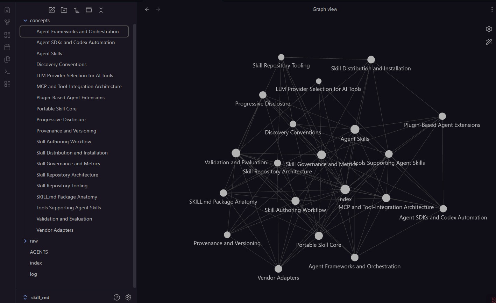

# LLM Wiki

## What This Is

This is a simple LLM-maintained wiki built from a folder of raw sources.

The important idea is that the wiki is organized by concept, not by source or by person. Raw materials stay in `raw/`, while generated wiki pages live outside `raw/`, such as in `concepts/`.

I made this deliberately simple. There are ways to automate the whole workflow, but I did not want to spend unnecessary tokens on orchestration before the basic pattern was useful.



## How I Created It

1. Collected raw source files into `raw/`.
2. Created `AGENTS.md` to define the wiki rules and maintenance workflow.
3. Used one kickoff prompt to ask the LLM to build the first version of the wiki.
4. Let the LLM create concept-based articles, update `index.md`, and append to `log.md`.
5. Continued improving the wiki through small ingest, query, and maintenance tasks.

## Kickoff Prompt

```text
I have a folder of raw sources on [TOPIC] from the following
sources: [SOURCE 1], [SOURCE 2], [SOURCE 3], [SOURCE 4].

Read all of these and build me a structured wiki organized by
concept - not by source or by person.

For each major concept, write a standalone article that:

- Explains what the concept is in plain language
- Summarizes what the key ideas and evidence say
- Notes where these sources agree
- Specifically flags where they disagree and why
- Links to related articles within the wiki

Also create an index.md file that lists every article in the wiki
with a one-line description.

Write everything so a [DESCRIBE YOUR AUDIENCE - e.g. "complete
beginner," "curious non-expert," "practitioner with no academic
background"] can understand it.
```

## Maintenance Workflow

For a new source, add it to `raw/` and ask the LLM to ingest it. The LLM should read the source, create or update concept pages, update `index.md`, and append a dated entry to `log.md`.

For a question, ask the LLM to answer from the wiki first. If the answer is useful beyond the current chat, save it as a page and update the index and log.

For cleanup, ask for a wiki lint pass. The LLM should look for missing index entries, orphan pages, weak citations, duplicated concepts, stale open questions, and contradictions.

## References

These videos helped inspire the workflow:

- [LLM Wiki video](https://youtu.be/VRub1w-APTc?si=5sQW7fOBpwLjcnWp)
- [Andrej Karpathy Just 10x'd Everyone's Claude Code](https://youtu.be/sboNwYmH3AY?si=n2gK0yfXPe8WbV4v)
