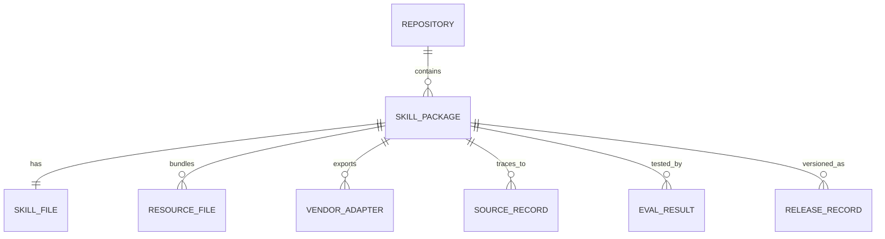
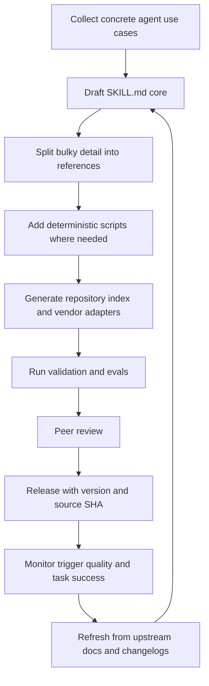

# skill.md for AI Agents

## Executive summary

For AI agents, `skill.md` is not just a loose idea. It is now an **emerging, concrete packaging convention** for reusable agent capabilities. Across documentation from entity["company","OpenAI","ai company"], entity["company","Anthropic","ai company"], and entity["company","GitHub","developer platform"], a skill is typically a directory containing a required `SKILL.md` file with YAML front matter and Markdown instructions, plus optional `scripts/`, `references/`, and `assets/`. The wider Agent Skills project describes this as an open format, and some documentation platforms also expose a docs-hosted lowercase `/skill.md` for discovery. citeturn14view9turn28view0turn28view1turn14view10turn27view0turn23view1

The cross-vendor **portable core** is small. In practice, the only universally recurring required fields are `name` and `description`, and routing often depends primarily on those two fields. Everything else is partly vendor- or repo-specific: OpenAI has optional `agents/openai.yaml` UI metadata, Anthropic emphasises progressive disclosure and keeping the main file lean, and Mintlify’s published format adds only minimal optional front-matter metadata such as `metadata.internal`. citeturn28view1turn28view0turn18view2turn18view3

If you are building a **repository of agent skills**, the best design is therefore a **portable skill core plus vendor adapters**. Store one canonical skill package per capability, keep the main `SKILL.md` concise, move bulky detail into `references/`, put deterministic operations into `scripts/`, and generate a machine-readable repository index plus any vendor-specific manifests from that source of truth. Keep provenance with source URLs and source Git SHAs, validate in CI, and version releases explicitly. citeturn28view0turn28view1turn19view0turn14view3

The most important operational lesson is that agent skills are **not human documentation with a new filename**. They work best when they package task routing, constraints, decision rules, examples, and references in a way that is short enough to fit into context and specific enough to trigger reliably. The best repository metrics are therefore not just counts of skills, but routing precision, task success, validation pass rate, stale-skill rate, and token footprint. citeturn27view0turn23view1turn28view0turn28view1

## What skill.md is for AI agents

For AI agents, the clearest interpretation is that `SKILL.md` is a **specific file format and packaging pattern**. OpenAI’s Codex docs define a skill as a directory with `SKILL.md` and optional resources, and state that the file must include `name` and `description`. Anthropic’s public guidance uses the same anatomy and explains a three-level loading model: metadata first, then the `SKILL.md` body, then bundled resources only when needed. GitHub Copilot’s docs likewise instruct authors to create a `SKILL.md` file and optionally add supplementary Markdown files or scripts. citeturn14view9turn28view0turn14view10

At the same time, the term is also becoming a **general concept for agent-readable guidance**. The Agent Skills overview calls it a standardised way to give agents new capabilities, while entity["company","Mintlify","documentation platform"] now publishes docs-site `skill.md` files and the `/.well-known/skills/default/skill.md` path for discovery. The distinction is useful: `SKILL.md` inside a skill package is the operational unit an agent installs and loads; site-level `skill.md` is a discovery surface that points agents towards product-specific instructions. citeturn27view0turn23view1

A good mental model is:

- **Package-level `SKILL.md`**: installable skill for an agent.
- **Site-level `skill.md`**: discoverable guidance published by a docs site.
- **Repository of skills**: the maintained collection of those packages, their metadata, their source provenance, and their release history.

The implementation differences between major public approaches are small but important. citeturn14view8turn27view0turn23view1

| Implementation                                                                                                  | Core contract                                      | Optional files and metadata                                                                                                                      | Main implication                                                |
| --------------------------------------------------------------------------------------------------------------- | -------------------------------------------------- | ------------------------------------------------------------------------------------------------------------------------------------------------ | --------------------------------------------------------------- |
| OpenAI Codex citeturn14view9turn28view1                                                                     | `SKILL.md` with required `name` and `description`  | `scripts/`, `references/`, `assets/`, recommended `agents/openai.yaml` with fields such as `display_name`, `short_description`, `default_prompt` | Keep a portable core, then generate OpenAI-specific UI metadata |
| Anthropic skills citeturn14view11turn28view0                                                                | `SKILL.md` with YAML front matter and instructions | `scripts/`, `references/`, `assets/`; progressive disclosure guidance; main file ideally kept under about 500 lines                              | Route with concise metadata, push detail into references        |
| GitHub Copilot skills citeturn14view10                                                                       | `SKILL.md` plus instructions                       | supplementary Markdown and scripts                                                                                                               | Repository structure should support linked resources cleanly    |
| Mintlify and Agent Skills format citeturn14view8turn18view0turn18view2turn18view3turn23view1turn27view0 | YAML front matter with `name` and `description`    | optional `metadata.internal`; docs-site `/skill.md`; recommended sections such as “When to Use” and resources                                    | Useful as a portability baseline and discovery pattern          |

The most important design conclusion is that **there is already a recognisable format**, but **not yet a single fully converged cross-vendor schema** beyond the small portable core. That should shape how you design your repository. citeturn28view1turn28view0turn18view2

## Recommended repository model and schema

A repository for agent skills should treat each skill as a **package**, not just a single file. The package should include the skill instructions, supporting resources, vendor adapters, provenance, and release metadata. This is also how the most mature public examples organise their content: Anthropic and OpenAI both separate body text from resources, and the `antfu/skills` repository goes further by keeping index files plus generation or sync metadata with source Git SHAs. citeturn28view0turn28view1turn19view0

A compact data model looks like this.



The portable core should stay close to what current agent runtimes already understand, while repository-only metadata should live either in front matter or in a separate index. A practical field set is below. It is a recommendation derived from current public skill formats and repository practice. citeturn18view0turn18view2turn28view1turn19view0

| Field group | Recommended fields | Why it belongs |
|---|---|---|
| Portable routing core | `name`, `description` | These fields are consistently required and often drive activation. |
| Task scope | `when_to_use`, `when_not_to_use`, `inputs`, `outputs` | Improves routing precision and reduces false triggers. |
| Instructions | `steps`, `decision_rules`, `constraints`, `failure_modes` | Turns the skill into a repeatable workflow instead of a prose memo. |
| Resource pointers | `references[]`, `scripts[]`, `assets[]` | Matches public package structures and keeps the main file lean. |
| Examples | `examples[]`, `test_prompts[]` | OpenAI explicitly recommends concrete examples during skill design. |
| Vendor adapters | `openai.yaml`, repo-side `metadata.internal`, future client adapters | Avoids polluting the portable core with client-specific UI fields. |
| Provenance | `source_url`, `source_sha`, `source_type`, `last_sync` | Supports refresh, trust, and reproducibility. |
| Ownership and lifecycle | `owner`, `reviewer`, `status`, `version`, `release_tag` | Essential for operating a shared repository. |
| Validation and quality | `schema_version`, `lint_status`, `eval_status`, `last_validated_at` | Makes the repository governable instead of ad hoc. |

The cleanest implementation pattern is a **three-layer repository**:

- **Canonical package layer**: the skill directory with `SKILL.md` and resources.
- **Repository index layer**: YAML or JSON entries for search, ownership, release, and validation metadata.
- **Vendor adapter layer**: generated files such as `agents/openai.yaml` or internal manifests.

This balances portability, authoring ergonomics, and automation. Front matter is a natural fit because it lets you keep human-editable content and metadata together, while JSON and JSON Schema give you stronger machine validation and downstream interoperability. citeturn24view0turn14view3

A short example of an individual skill file:

```markdown
---
name: pr-review-helper
description: Helps review pull requests by checking code quality, tests, and documentation.
version: 2026.04.25
owner: developer-experience
reviewer: repo-maintainer
source_url: https://example.org/docs/pr-review
source_sha: abc123def456
tags: [code-review, github, qa]
---

# Pull Request Review Helper

## When to Use
Use this skill when reviewing a pull request, preparing a pull request for review, or checking whether a change is safe to merge.

## When Not to Use
Do not use this skill for architecture reviews, security incident response, or repository setup.

## Inputs
- Pull request diff
- Test results
- Relevant repository standards

## Steps
1. Read the diff and classify the change.
2. Check tests and coverage implications.
3. Review naming, readability, and consistency.
4. Verify documentation and changelog impact.
5. Produce a short review summary and action list.

## Failure Modes
- Missing repository conventions
- Incomplete test context
- Large diffs that require deeper references

## References
- references/review-checklist.md
- references/repo-standards.md

## Scripts
- scripts/check_changed_files.py
```

A simple repository index entry:

```yaml
repo_id: agent-skills
released_at: 2026-04-25
skills:
  - name: pr-review-helper
    path: skills/pr-review-helper
    status: active
    owner: developer-experience
    vendor_adapters:
      - agents/openai.yaml
    source_url: https://example.org/docs/pr-review
    source_sha: abc123def456
    last_validated_at: 2026-04-25
    eval_status: pass
```

And a minimal machine-readable JSON export:

```json
{
  "name": "pr-review-helper",
  "description": "Helps review pull requests by checking code quality, tests, and documentation.",
  "status": "active",
  "resources": {
    "references": ["references/review-checklist.md", "references/repo-standards.md"],
    "scripts": ["scripts/check_changed_files.py"]
  },
  "provenance": {
    "source_url": "https://example.org/docs/pr-review",
    "source_sha": "abc123def456",
    "last_validated_at": "2026-04-25"
  }
}
```

## Authoring and maintenance workflow

The strongest public guidance converges on the same operational pattern: **start from concrete use cases, build a concise core, push weight into resources, validate, then iterate from real usage**. OpenAI’s skill-creation guidance explicitly recommends understanding the skill through concrete examples, then planning reusable resources, editing the skill, validating it, and iterating based on use. Anthropic’s public skill-writing guidance similarly emphasises progressive disclosure and keeping the main file concise. citeturn28view1turn28view0



A practical workflow has five stages.

### Draft from high-priority sources

For agent skills, the best source order is different from human skills taxonomies. The priority should usually be:

| Source type | Value for agent skills | Suggested priority |
|---|---|---|
| Official product docs, API references, SDK docs, policy docs | Highest-confidence source for exact behaviour, constraints, and current syntax | Highest |
| Internal runbooks, team conventions, templates | Best source for organisation-specific workflows and “tribal knowledge” | Highest for internal agents |
| Example repos, tests, and working scripts | Best source for executable patterns and deterministic steps | High |
| Release notes, changelogs, issue trackers | Best source for recent deltas and deprecations | High |
| Community repos and contributed skills | Good for discovering patterns and portability ideas | Medium |
| Vendor blogs and general tutorials | Useful for inspiration, weaker as source of truth | Lower |

This ordering follows directly from the purpose of an agent skill: it is operational guidance, not a broad conceptual taxonomy. Public repo practice such as `antfu/skills` also reflects this by generating or syncing skills from project documentation and recording the source SHA in accompanying metadata. citeturn19view0

### Keep the routing layer short

A repeated lesson from the public docs is that the main skill file must stay short enough to route and load efficiently. Anthropic recommends keeping `SKILL.md` under roughly 500 lines where possible, and OpenAI recommends keeping the body to essentials and splitting out larger reference material. The reason is architectural, not cosmetic: the whole point of skill loading is that detailed content appears only when needed. citeturn28view0turn28view1

### Use scripts for determinism

When a task is fragile, repetitive, or syntax-sensitive, put it in `scripts/` instead of prose. OpenAI’s guidance is explicit that executable code is useful when deterministic reliability is needed or the same code would otherwise be rewritten repeatedly. In repository terms, this means you should distinguish between skills that are primarily **instructional** and skills that are partly **instructional plus executable**. citeturn28view1

### Validate automatically

The current ecosystem already treats validation as a first-class concern. Mintlify’s format docs state that skills should be validated for YAML correctness, required fields, uniqueness, and naming rules, while JSON Schema exists to enforce consistency and interoperability at machine level. In a serious repository, validation should therefore cover three things: syntax, structure, and execution quality. citeturn18view0turn18view2turn14view3

At minimum, validate:

- YAML front matter parses cleanly.
- `name` and `description` exist and meet naming rules.
- referenced files actually exist.
- generated vendor adapters are in sync with the canonical package.
- evaluation prompts still pass after a change.

### Preserve provenance and version history

A skill repository should be operated like code. Git tags give release points, blame and history help explain changes, and release metadata should record exactly what documentation or repo commit the skill was derived from. The `antfu/skills` repository is a useful concrete example because it stores `GENERATION.md` or `SYNC.md` files with source Git SHAs and dates, and its generated `SKILL.md` indexes also record versioning information. citeturn17view0turn17view1turn17view2turn19view0

## Tools and platform choices

For most teams, the simplest workable setup is **Git plus a static documentation site plus CI validation**. Only add graph or semantic infrastructure if you have enough skills, references, or usage logs to justify it. This is consistent with the current public ecosystem, where the package format itself is file-based and repository structures are usually plain directories. citeturn27view0turn28view0turn28view1

A practical tooling split looks like this.

| Tooling layer | Good options | Best use | Main trade-off |
|---|---|---|---|
| Canonical repository | Plain Git repo | Source of truth for packages, review, releases | Needs disciplined structure |
| Documentation and browse | MkDocs, Docusaurus, Hugo | Human browseability, searchable docs, release notes | Static browse does not equal semantic routing |
| Validation | YAML lint plus JSON Schema | Front matter and index correctness | Syntax passing does not prove task quality |
| Search | static search, pgvector, entity["company","Neo4j","graph db company"], entity["company","Elastic","search company"] or OpenSearch | Find skills, references, similarities, related packages | More infrastructure, and vector retrieval is approximate in some systems |
| Visualisation | taxonomy pages, generated graphs, Mermaid | Repository maps and dependency views | Often best generated from the index, not hand-maintained |

The platform comparison below is the most useful short view.

| Platform | Strongest use for agent skill repos | Advantages | Limits |
|---|---|---|---|
| MkDocs citeturn14view17 | Simple public or internal catalogue | Markdown-native and easy for contributors | Limited built-in semantics |
| Docusaurus citeturn14view12 | Versioned skill documentation | Good release snapshots and docs UX | Versioning adds contributor overhead |
| Hugo citeturn24view0turn14view18 | File-based skill directories with front matter and taxonomies | Very strong fit for package metadata and taxonomy pages | Relationship logic still needs generation |
| pgvector on Postgres citeturn15view3 | Lightweight semantic search over skills and references | Keeps embeddings with ordinary relational data | Approximate indexes trade recall for speed |
| Neo4j citeturn15view4turn15view5 | Skill dependency graphs plus vector search | Strong for prerequisite, related-skill, and resource graphs | Adds graph-database complexity |
| Elastic or OpenSearch citeturn15view0turn15view1turn15view2 | Large-scale hybrid search | Strong keyword plus semantic capabilities | Heavier to run and tune |

A sensible default stack is:

- Git repo with one directory per skill.
- Markdown plus YAML for the canonical package.
- YAML or JSON repository index.
- static site for humans.
- CI validation and eval runs.
- optional semantic or graph search only after the catalogue becomes large enough to need it.

## Governance, metrics, and pitfalls

An agent skill repository needs governance because skills can change agent behaviour directly. That means four governance layers matter: **ownership**, **source control**, **validation**, and **licensing**. Ownership means every skill has a maintainer and reviewer. Source control means every release records which upstream docs or repo commit it came from. Validation means syntax and eval quality are tested before release. Licensing means documentation content and executable code are treated deliberately rather than casually copied. SPDX is useful for software-oriented metadata, while entity["organization","Creative Commons","copyright licenses nonprofit"] licences are appropriate for many documentation assets. citeturn29view1turn29view0turn29view2

The most useful KPIs are operational, not decorative.

| KPI | Why it matters |
|---|---|
| Trigger precision | Measures whether `name` and `description` route the agent to the right skill |
| Trigger recall | Measures whether the right skill is being missed |
| Task success rate | Measures whether the skill actually improves outcomes |
| Validation pass rate | Measures repository hygiene |
| Eval pass rate | Measures behavioural quality after changes |
| Stale-skill rate | Measures how many skills are out of sync with upstream docs |
| Mean refresh time | Measures how quickly the repo reflects upstream changes |
| Token footprint | Measures whether `SKILL.md` bodies are growing beyond practical context size |
| Duplicate-skill rate | Measures catalogue sprawl and weak naming discipline |
| Reference hit rate | Measures whether references are useful or merely clutter |

These KPIs follow directly from the architecture described in the public docs: skills are discovered by small metadata, loaded progressively, and improved through iteration and validation. citeturn28view0turn28view1turn27view0turn18view0

The most common pitfalls are predictable.

- **Treating `SKILL.md` as human docs with a new filename.** Public vendor guidance exists because human documentation is too broad, too scattered, or too verbose for reliable agent execution. citeturn23view1turn27view0
- **Overloading the routing layer.** When too much detail stays in the main file, trigger quality and context efficiency deteriorate. citeturn28view0turn28view1
- **Writing vague descriptions.** In some implementations only `name` and `description` matter for initial selection, so weak phrasing directly harms routing. citeturn28view1turn14view9
- **Duplicating detail across body and references.** OpenAI explicitly recommends keeping detailed schemas and examples in references rather than bloating the core. citeturn28view1
- **Skipping concrete examples and evals.** Public guidance suggests understanding skills through examples and validating before iteration. citeturn28view1
- **Mixing portable content with vendor-specific UI fields.** The ecosystem has not fully converged beyond the portable core, so adapters should stay separate. citeturn28view1turn18view3
- **Ignoring provenance.** Without source URLs and source SHAs, the repo becomes impossible to refresh confidently. citeturn19view0turn17view0

The central trade-off is simple: **the more portable the skill, the less vendor-specific metadata you should embed in the canonical package; the more polished the client experience, the more adapter files you will likely need**. A well-run repository accepts that trade-off and manages it explicitly instead of pretending it does not exist. citeturn28view1turn18view3

## Open questions and limitations

The public evidence reviewed here is strong on package anatomy and authoring practice, but there are still open points.

The ecosystem is **converging, not fully standardised**. The portable core is clear, but optional metadata differs between implementations such as OpenAI’s `agents/openai.yaml`, Anthropic’s progressive-disclosure guidance, and Mintlify’s lighter metadata model. citeturn28view1turn28view0turn18view3

Discovery conventions are also still evolving. Package-level uppercase `SKILL.md` is the clearest common pattern, while site-level lowercase `/skill.md` and `/.well-known/skills/default/skill.md` are emerging discovery surfaces rather than a single settled universal rule. citeturn23view1turn27view0

Finally, the sources reviewed here do not establish one universal cross-vendor evaluation suite for agent skills. Validation guidance exists, and repository practice shows how to version, sync, and lint skills, but a shared public conformance benchmark for skill triggering and execution was not clearly established in the gathered material. citeturn18view0turn19view0turn28view1